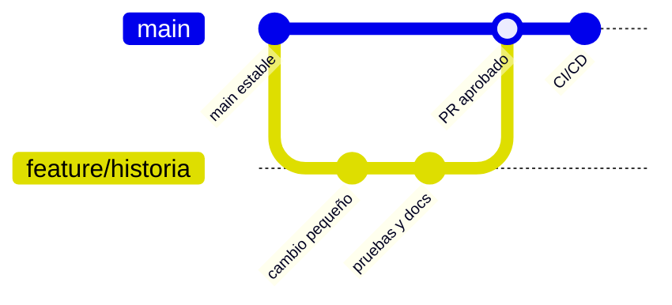

# Estrategia de ramas y revisión

Adopción documentada: 15 de julio de 2026.

## Modelo

CrediBot adopta trunk-based development con ramas breves. No se mantiene una rama
`develop`, porque el equipo y la duración del proyecto no justifican su costo.

## Convenciones

| Tipo | Patrón | Ejemplo |
| --- | --- | --- |
| Funcionalidad | `feature/<id>-<descripcion>` | `feature/us-16-plantillas-whatsapp` |
| Corrección | `fix/<id>-<descripcion>` | `fix/cr-001-confirmacion-nombre` |
| Documentación | `docs/<descripcion>` | `docs/cierre-academico` |
| Mantenimiento | `chore/<descripcion>` | `chore/actualiza-dependencias` |

## Flujo obligatorio

1. Seleccionar una historia `Ready` del tablero.
2. Crear rama desde `main` actualizada.
3. Realizar commits pequeños y descriptivos en español.
4. Ejecutar pruebas locales pertinentes.
5. Abrir pull request con historia, criterios, pruebas y riesgos.
6. Esperar CI de backend y frontend cuando corresponda.
7. Obtener al menos una aprobación de otra persona cuando esté disponible.
8. Fusionar sin reescribir evidencia ajena.
9. Verificar despliegue y mover la historia a `Done`.

## Protección recomendada de `main`

- Pull request obligatorio.
- Al menos una aprobación.
- Conversaciones resueltas antes de fusionar.
- Checks requeridos: `Probar backend FastAPI` y `Probar build del dashboard`.
- Rama actualizada antes de fusionar.
- Prohibir force push y eliminación de `main`.
- Restringir bypass a administradores solo para incidentes documentados.

## Evidencia

- PR #1 demuestra el flujo `feature/cleanup-publish` → `main`.
- La rama `docs/cierre-academico` aplica esta estrategia para los entregables finales.
- Los commits del cierre se separan en gestión, modelado, funcionalidad y presentación.

La estrategia se declara desde su adopción real. Los commits anteriores directos a `main`
se conservan como deuda de proceso y no se presentan como pull requests inexistentes.
