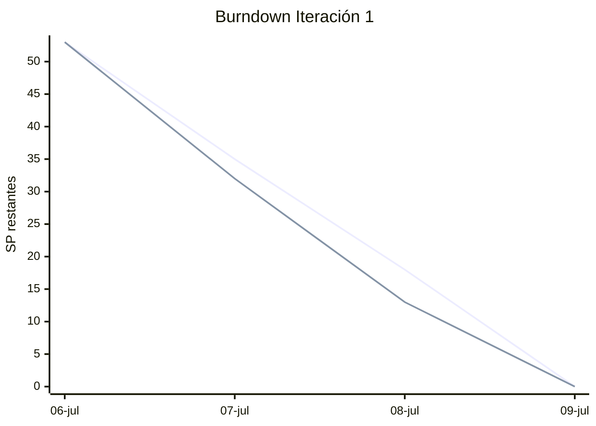
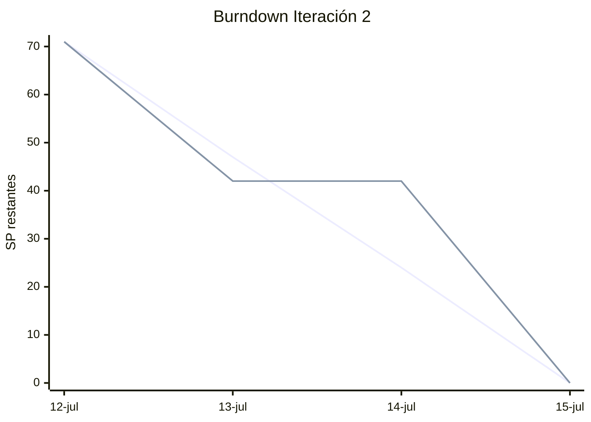

# Métricas del proyecto

Corte funcional: 15 de julio de 2026, commit `f2d59d7`.  
Fuente: historial Git, cobertura local y GitHub Actions.

## Resumen por iteración

| Métrica | Iteración 1 | Iteración 2 |
| --- | ---: | ---: |
| Periodo | 6–9 julio | 12–15 julio |
| Historias comprometidas | 9 | 9 |
| Story points comprometidos | 53 | 71 |
| Story points terminados al cierre documental | 53 | 71 |
| Velocidad | 53 SP | 71 SP |
| Commits del corte funcional | 19 | 61 |
| Participantes con commits | 4 | 3 |
| Líneas agregadas en el corte funcional | 11.286 | 19.475 |
| Líneas eliminadas en el corte funcional | 1.906 | 5.511 |
| Tiempo entre primer y último commit | 60,93 h | 90,94 h |

Velocidad media: **62 SP por iteración**.

Los puntos son una medida relativa de complejidad, incertidumbre y esfuerzo; no equivalen
a horas ni se usan para comparar personas. La segunda iteración incluye despliegue,
seguridad, datos y reconstrucción documental, por eso su alcance es mayor.

## Burndown reconstruido desde evidencia de finalización

No existía un tablero durante los primeros incrementos. El burndown se reconstruye a
partir de la fecha de los commits que completan cada historia y se identifica como tal.
Los siguientes proyectos deben obtener esta métrica directamente del tablero.

### Iteración 1

| Fecha | Ideal restante | Real reconstruido |
| --- | ---: | ---: |
| 6 julio — inicio | 53 | 53 |
| 7 julio | 35 | 32 |
| 8 julio | 18 | 13 |
| 9 julio — cierre | 0 | 0 |

### Iteración 2

| Fecha | Ideal restante | Real reconstruido |
| --- | ---: | ---: |
| 12 julio — inicio | 71 | 71 |
| 13 julio | 47 | 42 |
| 14 julio | 24 | 42 |
| 15 julio — cierre documental | 0 | 0 |

La línea plana del 14 de julio indica ausencia de evidencia integrada en `main`, no
ausencia de trabajo personal. No se atribuye actividad que Git no permite verificar.

## Calidad y entrega

| Indicador | Resultado observado |
| --- | --- |
| Cobertura de líneas backend | 66,6 % en `backend/coverage.xml` antes del cierre |
| Módulos de prueba backend | 24 antes de US-16; 25 después de plantillas |
| Pruebas frontend | Suite Vitest de métricas |
| Calidad backend | Ruff format, Ruff check y Mypy en CI |
| Calidad frontend | ESLint, Vitest y build TypeScript/Vite en CI |
| Pipeline | 4 workflows: CI backend/frontend y CD backend/frontend |
| Disponibilidad comprobada | Frontend y `/api/health` responden HTTP 200 |
| Sonar | Python 3.12 configurado y migraciones excluidas solo de duplicación |

## Lectura para decisiones

- La subida de 53 a 71 SP indica mayor alcance, no necesariamente mayor productividad.
- Los fallos de despliegue del 15 de julio revelaron permisos y validaciones insuficientes;
  se agregaron políticas IAM y verificaciones de salud.
- La retroalimentación de conversación produjo CR-001 y justificó priorizar pruebas de
  comportamiento sobre nuevas funciones comerciales.
- US-19 y US-20 quedan en backlog porque alarmas y staging aportan más valor operativo
  que continuar ampliando el MVP académico.
