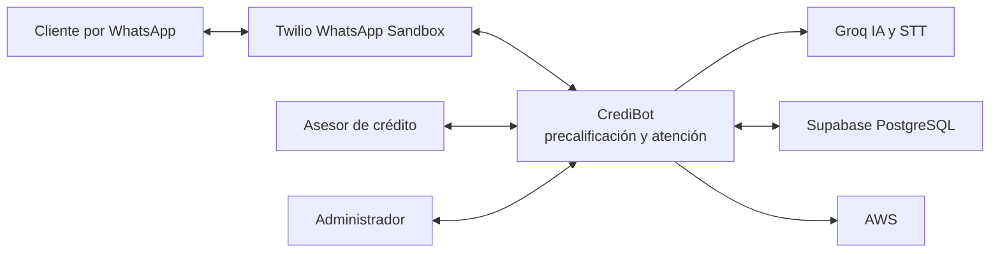
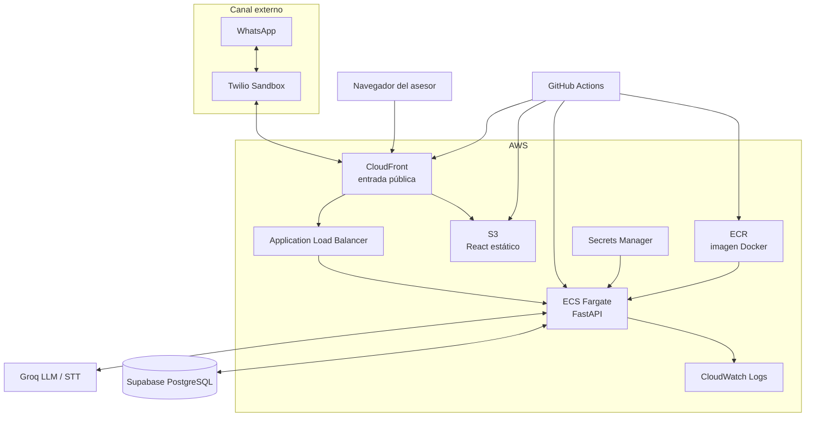
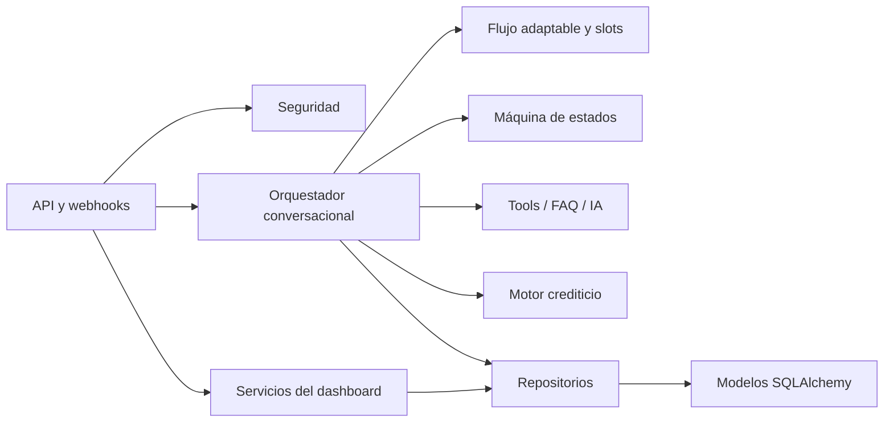

# Arquitectura como código

## 1. Diagrama de contexto

### Responsabilidades externas

- El cliente conversa, autoriza datos, corrige información y solicita un asesor.
- El asesor toma el caso, responde y registra la resolución.
- Twilio entrega webhooks y mensajes dentro del entorno académico permitido.
- Groq clasifica intención, extrae propuestas, redacta y transcribe; no decide el crédito.
- Supabase conserva la fuente transaccional y de reglas.
- AWS aloja y distribuye la aplicación.

## 2. Diagrama de contenedores

## 3. Componentes principales del backend

## Decisiones arquitectónicas

1. La IA interpreta lenguaje natural, pero las reglas crediticias son deterministas.
2. El teléfono identifica al cliente y cada conversación tiene contexto propio.
3. El handoff cambia control operativo; no es solo una etiqueta visual.
4. CloudFront ofrece un único origen público para frontend, API, webhook y audio.
5. Los secretos no forman parte de la imagen ni del repositorio.
6. Las políticas se versionan para poder explicar con qué reglas se obtuvo un resultado.
