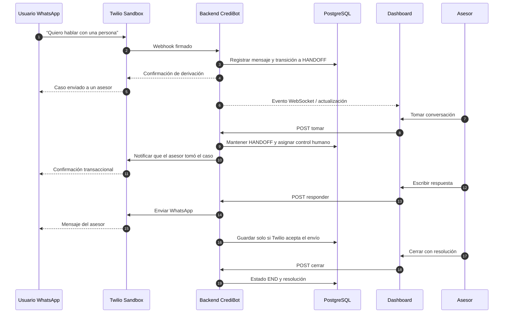
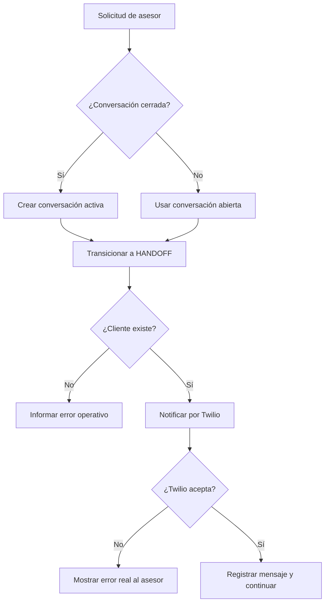

# Derivación bot–humano

## Secuencia principal

## Reglas de control

1. La intención de asesor se evalúa antes de continuar el flujo automático.
2. En `HANDOFF`, cualquier mensaje nuevo se registra, pero el bot permanece silencioso.
3. El panel exige autenticación y el rol adecuado.
4. Una respuesta fallida de Twilio no se registra como entregada.
5. El asesor elige una resolución y puede añadir una nota.
6. Al cerrar, el siguiente contacto vuelve a `START` con una conversación nueva.

## Casos alternos

La ruta humana está disponible mediante lenguaje natural, no depende de completar primero
la precalificación y cumple la exigencia de escalamiento permanente del caso académico.
