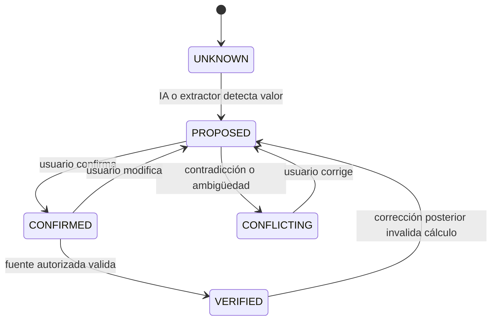

# Modelo de dominio

## Dominio transaccional y crediticio

```mermaid
erDiagram
    CUSTOMER ||--o{ CONVERSATION : mantiene
    CUSTOMER ||--o{ CREDIT_APPLICATION : solicita
    CUSTOMER ||--o| CUSTOMER_FINANCIAL_PROFILE : declara
    CUSTOMER ||--o{ CONSENT_RECORD : autoriza
    CONVERSATION ||--o{ MESSAGE : contiene
    CONVERSATION ||--o{ CONVERSATION_STATE_HISTORY : transiciona
    CONVERSATION ||--|| CONVERSATION_CONTEXT : recuerda
    CONVERSATION ||--o{ AI_ANALYSIS : registra
    CREDIT_APPLICATION ||--o{ APPLICATION_DOCUMENT : requiere
    CREDIT_APPLICATION ||--o{ CREDIT_DECISION : recibe
    CREDIT_APPLICATION }o--|| CREDIT_PRODUCT : selecciona
    CREDIT_PRODUCT ||--o{ CREDIT_PRODUCT_REQUIREMENT : exige
    CREDIT_PRODUCT ||--o{ CREDIT_POLICY_VERSION : regula
    CREDIT_POLICY_VERSION ||--o{ CREDIT_POLICY_RULE : contiene

    CUSTOMER {
        int id PK
        string phone_number UK
        string full_name
        string national_id
    }
    CONVERSATION {
        int id PK
        int customer_id FK
        string current_state
        string status
        string result
        string response_mode
    }
    CONVERSATION_CONTEXT {
        int conversation_id FK
        json slots
    }
    CREDIT_APPLICATION {
        int id PK
        int customer_id FK
        decimal requested_amount
        int term_months
        string result
        string reason
    }
    CREDIT_PRODUCT {
        int id PK
        string code UK
        string name
        boolean active
    }
    CREDIT_POLICY_VERSION {
        int id PK
        int product_id FK
        string version
        date effective_from
    }
    CREDIT_DECISION {
        int id PK
        int application_id FK
        string outcome
        json reason_codes
        decimal estimated_payment
    }
```

## Estados de un campo conversacional

Cada slot conserva `value`, `status`, `source`, `confidence` y fecha. Esta separación
impide tratar un dato inferido por IA como dato confirmado o verificado.

## Invariantes del negocio

- Ningún resultado es una aprobación definitiva automática.
- Sin consentimiento de privacidad no se recopilan datos de precalificación.
- Sin autorización separada no se consulta la central simulada.
- Una política y sus razones deben poder identificarse después de la evaluación.
- Un valor corregido invalida los cálculos que dependen de él.
- Una alerta PEP, fraude o identidad deriva a revisión humana; no produce rechazo automático.
- Los perfiles sintéticos están marcados y no se presentan como personas reales.
