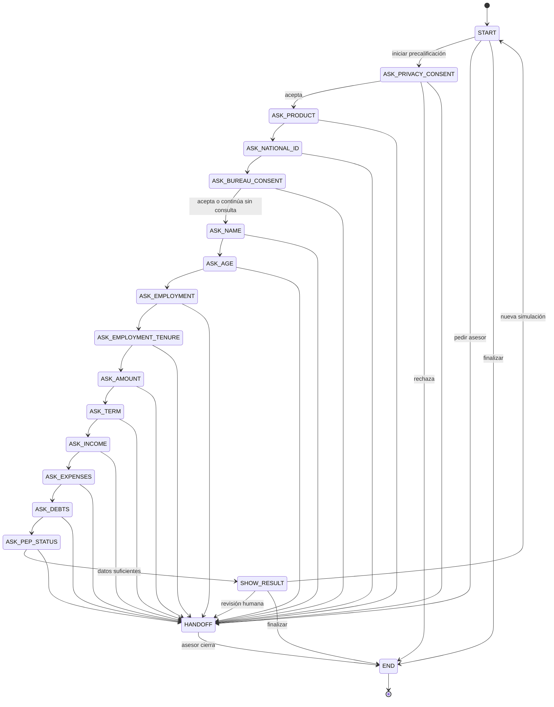

# Máquina de estados conversacional

El diagrama refleja `backend/app/state_machine/states.py`. El flujo adaptable puede
rellenar varios campos en cualquier orden, pero el estado indica la siguiente necesidad
de mayor prioridad y conserva una transición auditable.

## Reglas de transición

- `HANDOFF` es alcanzable desde cualquier estado activo.
- Mientras una conversación permanece en `HANDOFF`, el bot no genera respuestas automáticas.
- El asesor solo puede responder manualmente en `HANDOFF`.
- Al cerrar, se registra resolución, la conversación pasa a `END` y el siguiente mensaje
  crea una conversación nueva.
- Una pregunta lateral no obliga a cambiar de estado: se responde y se conserva el campo pendiente.
- Una corrección puede hacer que la necesidad prioritaria vuelva a un campo anterior sin borrar
  los campos independientes que continúan siendo válidos.

## Resultado de negocio

`SHOW_RESULT` presenta `APTO` u `OBSERVADO`, cuota estimada y razones. La decisión formal
solo puede realizarla un asesor o una entidad autorizada fuera del alcance del MVP.
