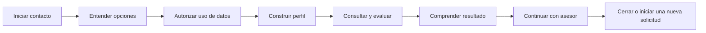

# Story Mapping

Persona principal: persona interesada en un crédito de consumo.  
Personas secundarias: asesor operativo y administrador del conocimiento.  
Objetivo: obtener orientación y una precalificación explicable por WhatsApp, con salida
permanente hacia atención humana.

## Recorrido del usuario

## Mapa por actividades y tareas

| Actividad | Tareas del usuario | Respuesta o capacidad del sistema |
| --- | --- | --- |
| Iniciar contacto | Saludar, escribir o enviar audio | Recibir webhook, transcribir y presentar alcance |
| Entender opciones | Preguntar requisitos, tasa, productos o proceso | Detectar intención y consultar catálogo/FAQs |
| Autorizar datos | Aceptar o rechazar privacidad y consulta de buró | Registrar consentimientos separados y revocables |
| Construir perfil | Dar nombre, cédula, monto, plazo, ingresos, gastos y deudas | Extraer varios campos, validar, confirmar y recordar procedencia |
| Consultar y evaluar | Corregir datos o solicitar simulación | Consultar buró sintético y ejecutar reglas versionadas |
| Comprender resultado | Pedir explicación o cambiar condiciones | Mostrar cuota, resultado preliminar y códigos de razón |
| Continuar con asesor | Escribir “asesor” en cualquier momento | Cambiar a `HANDOFF`, detener bot y notificar al panel |
| Cerrar o reiniciar | Resolver duda, aprobar o negar como asesor | Registrar resolución, cerrar y permitir una sesión nueva |

## Cortes de entrega

| Actividad | MVP — Iteración 1 | Incremento — Iteración 2 | Futuro |
| --- | --- | --- | --- |
| Contacto | Texto y audio por Sandbox | Validación de firma y preferencia de respuesta | WhatsApp Cloud API productiva |
| Opciones | Intenciones básicas | FAQs y consultas laterales | Recomendación multproducto |
| Consentimiento | Aviso inicial | Registros versionados y autorización de buró | Portal de derechos del titular |
| Perfil | Campos mínimos secuenciales | Campos flexibles, correcciones y procedencia | Verificación documental externa |
| Evaluación | Reglas demostrativas | Productos/políticas en PostgreSQL y dataset masivo | Política aprobada por entidad real |
| Resultado | Preaprobado/observado | Explicación, cuota y razones auditables | Oferta contractual y firma |
| Asesor | Handoff por palabra clave | Dashboard autenticado, respuesta y cierre | Enrutamiento por cola y SLA |
| Operación | Registro de mensajes | CI/CD, seguridad y métricas | Staging, alarmas y trazas distribuidas |

## Relación con el backlog

- Contacto y opciones: US-01, US-02, US-09 y US-10.
- Perfil y evaluación: US-03, US-04, US-05, US-14 y US-15.
- Resultado: US-06 y US-16.
- Asesor: US-07 y US-08.
- Operación y evidencia: US-11, US-12, US-13, US-17 y US-18.

El mapa expresa el viaje del usuario; el Product Backlog conserva estimación, prioridad y
criterios de aceptación de cada porción entregable.
