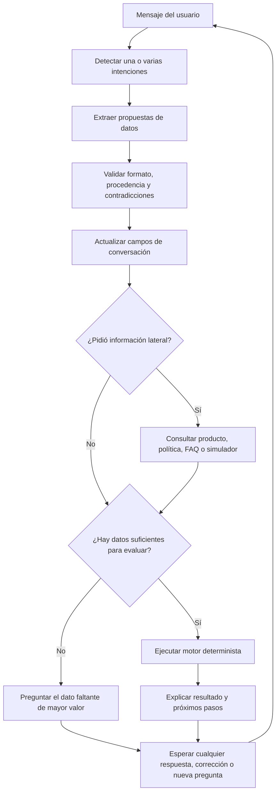

# Modelo de originación crediticia para CrediBot

Fecha de investigación: 15 de julio de 2026  
Ámbito: Ecuador, personas naturales, crédito de consumo y orientación inicial sobre microcrédito.  
Estado: diseño funcional para datos sintéticos y precalificación informativa; no sustituye la política aprobada de una entidad financiera ni una decisión humana.

## 1. Objetivo y límites

CrediBot debe orientar, simular cuotas, recopilar información para una solicitud y emitir una **precalificación explicable**. No debe prometer desembolsos ni tomar por sí solo una decisión definitiva de crédito.

La aplicación separará tres responsabilidades:

1. La base de datos conserva productos, requisitos, versiones de política, perfil financiero, consentimientos, evidencia y resultados auditables.
2. Un motor determinista calcula cuotas, capacidad de pago y cumplimiento de reglas versionadas.
3. La IA interpreta lenguaje natural, detecta intenciones, extrae datos propuestos y redacta respuestas. La IA no inventa tasas, no modifica reglas y no decide la aprobación.

Todos los registros del lote de demostración serán sintéticos, reproducibles y eliminables por identificador de lote. Las cédulas sintéticas usarán el prefijo reservado `99`, que no corresponde a los códigos provinciales ordinarios usados por una cédula ecuatoriana, y cada registro llevará `is_synthetic = true`.

## 2. Qué evalúa una entidad al otorgar crédito

La Superintendencia de Bancos define el riesgo de crédito como la posibilidad de pérdida por incumplimiento total, parcial o tardío. Para crédito de consumo exige especial atención a la capacidad de pago y a la estabilidad de los ingresos —sueldos, salarios, honorarios, remesas, rentas u otras fuentes— adecuadamente verificados. Para cartera comercial, la capacidad de pago y la situación financiera son el factor principal; también se consideran experiencia de pago y entorno económico.

Para una persona natural, el análisis funcional se agrupa así:

| Grupo | Datos o evidencia | Uso en CrediBot |
|---|---|---|
| Identidad | tipo y número de identificación, nombres, fecha de nacimiento, nacionalidad, domicilio, teléfono y correo | identificar al solicitante y evitar duplicados |
| Conocimiento del cliente | actividad económica, ocupación, empleador o negocio, condición PEP, origen y destino de fondos, beneficiario final cuando aplique | KYC y derivación a revisión reforzada |
| Ingresos | sueldo neto, honorarios, ventas, renta, pensión, remesas y otros ingresos recurrentes | estimar capacidad de pago |
| Estabilidad | tipo de empleo, antigüedad laboral, antigüedad del negocio o RUC, variabilidad y fecha de verificación | medir predictibilidad de la fuente de pago |
| Gastos | vivienda, alimentación, servicios, transporte, educación, salud, dependientes y otros gastos esenciales | obtener ingreso disponible sin sobreestimar capacidad |
| Deudas | saldos, cuotas mensuales, tarjetas, mora actual, máximo atraso, refinanciaciones y castigos | calcular carga financiera y comportamiento histórico |
| Patrimonio | activos, pasivos, vivienda, vehículo y bienes que podrían respaldar una garantía | solvencia y mitigación, nunca sustituto de capacidad de pago |
| Solicitud | producto, destino, monto, plazo, fecha de pago, tipo de amortización y garantía ofrecida | seleccionar reglas y simular condiciones |
| Evidencia | cédula, planilla de servicios, roles de pago, certificado laboral/IESS, estados de cuenta, RUC y declaraciones tributarias | verificar los datos declarados |
| Autorizaciones | aviso de privacidad, consentimiento cuando sea la base aplicable, autorización de consulta y aceptación de términos | trazabilidad legal y operativa |

### Diferencias según la fuente de ingresos

- Dependiente: roles de pago, certificado laboral o historia del IESS y antigüedad laboral.
- Independiente o profesional: RUC, declaraciones de IVA/renta, facturas y estados de cuenta de varios meses.
- Rentista: contrato de arrendamiento, predial y estados de cuenta.
- Jubilado: comprobante o rol de pensión.
- Microempresario: antigüedad del negocio, ventas, costos, flujo de caja, destino productivo y ciclo de cobro.

Los requisitos varían por entidad y producto. Banco Guayaquil acepta, según canal, estados de cuenta, roles, certificados, comprobantes, facturas o contratos de arrendamiento. BanEcuador pide identidad, papeleta de votación, planilla de servicio y evidencia de ingresos; Banco Pichincha diferencia documentos para dependientes, independientes, rentistas y jubilados. Estas referencias justifican el modelo de datos, pero no se copiarán como una política contractual de CrediBot.

## 3. Parámetros calculados

El motor deberá producir valores numéricos y códigos de razón, no una explicación libre.

### 3.1 Ingreso mensual verificable

Se calcula por fuente, usando importe, frecuencia, meses observados, estabilidad y estado de verificación. Un ingreso declarado pero no verificado puede servir para una simulación; no debe presentarse como confirmado.

### 3.2 Gasto e ingreso disponible

```text
ingreso_disponible = ingreso_neto_verificable - gastos_esenciales - cuotas_de_deuda_actuales
```

Si faltan gastos, el resultado debe ser `NEEDS_INFORMATION`; no se asumirá que son cero.

### 3.3 Relación deuda/ingreso

```text
DTI_actual = cuotas_de_deuda_actuales / ingreso_neto_verificable
DTI_proyectado = (cuotas_de_deuda_actuales + cuota_nueva) / ingreso_neto_verificable
```

El límite no es una constante universal. Se almacenará por producto y versión de política. Las referencias comerciales que hablan de rangos de 35 % a 50 % son orientativas y no una regla legal general.

### 3.4 Cuota y costo

La simulación soportará tablas francesa y alemana. La tasa será leída del producto con vigencia; nunca será elegida por el modelo de IA. Además de la tasa del producto se conservará la tasa efectiva máxima del segmento y su fuente.

Para julio de 2026, el Banco Central publica máximos por segmento, entre ellos consumo 16,77 %, microcrédito minorista 28,23 %, acumulación simple 24,89 % y acumulación ampliada 22,05 %. Estas tasas cambian y por eso se modelan con `effective_from`, `effective_to` y fuente, no como constantes en código.

### 3.5 Historial y señales de riesgo

- score y nivel de riesgo, con fecha y proveedor;
- cuentas activas, cerradas, vencidas o castigadas;
- mora actual y máxima, pagos tardíos, parciales o incumplidos;
- consultas recientes;
- refinanciaciones, reestructuraciones, cobro judicial y alertas de fraude;
- antigüedad del historial y mezcla de productos.

El score es una señal, no la única decisión. La Superintendencia indica que el puntaje usa múltiples parámetros relacionados con probabilidad de incumplimiento y que el comportamiento de pago oportuno lo mejora.

### 3.6 Resultado explicable

Estados permitidos:

- `NEEDS_INFORMATION`: faltan datos indispensables o son contradictorios;
- `SIMULATION_ONLY`: hay datos declarados suficientes para una cuota, pero no para consultar/evaluar;
- `PREQUALIFIED`: cumple las reglas informativas de la versión aplicada;
- `MANUAL_REVIEW`: requiere verificación, debida diligencia ampliada o excepción;
- `NOT_PREQUALIFIED`: incumple una regla excluyente de la política simulada;
- `ERROR`: no se pudo completar la evaluación de forma segura.

Cada resultado incluirá versión de política, entradas utilizadas, cálculos, códigos de razón, documentos faltantes, fecha y la indicación `is_final_decision = false` para este alcance.

Ejemplos de códigos: `INCOME_UNVERIFIED`, `EXPENSES_MISSING`, `DTI_ABOVE_POLICY`, `ACTIVE_DELINQUENCY`, `INSUFFICIENT_TENURE`, `TERM_OUT_OF_RANGE`, `AMOUNT_OUT_OF_RANGE`, `PEP_REVIEW_REQUIRED`, `IDENTITY_NOT_VERIFIED`.

## 4. KYC, prevención y datos personales

La resolución de la UAFE exige identificar al cliente mediante documentos, datos o fuentes confiables e independientes y verificar su identidad antes o durante el establecimiento de la relación. Para una PEP contempla aprobación de alta gerencia, origen de fondos y monitoreo reforzado. La diligencia simplificada solo procede después de evaluar el bajo riesgo y verificar coherencia entre perfil económico y operación.

Por tanto:

- el chat no solicitará claves, PIN, CVV ni contraseñas;
- una marca PEP, alerta de fraude o inconsistencia de identidad produce revisión humana, no rechazo automático;
- se registrará la finalidad y la versión del aviso aceptado;
- se distinguirá dato declarado, extraído, verificado, calculado e importado;
- la información sensible no se incluirá en logs ni prompts salvo el mínimo necesario;
- el lote sintético no se mezclará con usuarios reales sin la marca de procedencia.

La Ley Orgánica de Protección de Datos Personales reconoce información sobre finalidad, base legal, conservación, origen, consecuencias de no entregar datos, revocación, derechos, transferencias y decisiones automatizadas. También contempla el derecho a no quedar sujeto únicamente a valoraciones automatizadas. CrediBot mostrará que la evaluación es preliminar y ofrecerá revisión por asesor.

## 5. Flujo conversacional adaptable

El flujo deja de ser una secuencia rígida. Se conserva un **objetivo activo** y un **registro de campos** independiente del orden del diálogo.



### Comportamientos necesarios

- El usuario puede entregar varios datos en un mensaje y en cualquier orden.
- Puede corregirlos: “no eran 24 meses, eran 36”. La corrección queda versionada.
- Puede interrumpir con “¿qué tasa usan?”; el bot responde desde la base y retoma el dato pendiente.
- Puede cambiar de producto o monto; se invalida solo el cálculo dependiente, no toda la conversación.
- Un valor ambiguo se confirma antes de persistirlo como verificado.
- Si la IA no está disponible, extractores deterministas mantienen los casos básicos y el bot formula una pregunta segura.
- Si una consulta está fuera de alcance, se explica el límite y se ofrece un asesor.
- Si faltan datos, jamás se convierte el faltante en cero ni se genera una aprobación incoherente.

Cada campo conversacional tendrá `value`, `status` (`UNKNOWN`, `PROPOSED`, `CONFIRMED`, `VERIFIED`, `CONFLICTING`), `source`, `confidence` y fecha. El siguiente dato a preguntar se seleccionará por reglas de dependencia, no por el estado previo de una máquina lineal.

## 6. Herramientas de la IA

Groq admite llamadas locales a herramientas: el modelo solicita una función con argumentos estructurados, la aplicación la ejecuta y devuelve el resultado. Este patrón permite que la IA converse sin tener acceso directo ni irrestricto a la base.

Herramientas previstas:

- `listar_productos_credito`: catálogo vigente y características;
- `consultar_requisitos_producto`: requisitos por producto y tipo de ocupación;
- `calcular_amortizacion`: cuota y tabla, con tasa proveniente del catálogo;
- `consultar_historial_crediticio`: perfil sintético por identificador autorizado;
- `evaluar_precalificacion`: reglas deterministas y resultado explicable;
- `consultar_estado_cliente`: solicitudes del usuario autenticado por el canal;
- `consultar_politica`: contenido informativo versionado;
- `solicitar_asesor`: transición explícita a atención humana.

Las entradas y salidas se validarán con esquemas. La herramienta de evaluación no aceptará una tasa enviada libremente por la IA y no expondrá información de otra persona solo porque el mensaje contenga una cédula.

## 7. Modelo de datos propuesto

### Operación (`public`)

- `credit_products`: segmentos, montos, plazos, tasas, amortización y vigencia.
- `credit_product_requirements`: documento o dato requerido, condiciones y etapa.
- `credit_policy_versions`: versión aprobada, vigencia y estado.
- `credit_policy_rules`: regla tipada, parámetros, severidad, explicación y orden.
- `customer_financial_profiles`: datos financieros declarados/verificados del solicitante real.
- `consent_records`: finalidad, versión, canal, evidencia y revocación.
- `application_documents`: tipo, estado de verificación y metadatos; no archivos binarios.
- `credit_decisions`: instantánea auditable de entradas, cálculos, razones y versión.
- `conversation_contexts`: objetivo, campos, pregunta pendiente y revisiones del diálogo.

### Simulación de buró (`credit_bureau`)

- `dataset_batches`: semilla, versión del generador, volumen y estado de carga.
- `people`: identidad sintética, demografía, empleo e indicadores agregados.
- `credit_accounts`: obligaciones históricas y vigentes.
- `payment_history`: comportamiento mensual.
- `credit_score_snapshots`: evolución del score.
- `credit_inquiries`: consultas recientes.
- `risk_events`: alertas y eventos adversos.

Las personas sintéticas no se insertarán como `customers`, para no contaminar el tablero de conversaciones. Se consultarán solo al usar explícitamente un identificador de demostración.

## 8. Dataset sintético funcional

Lote objetivo inicial, sujeto a una comprobación de espacio antes de cargar:

- 25.000 personas sintéticas;
- entre 40.000 y 65.000 cuentas crediticias;
- entre 500.000 y 900.000 pagos mensuales;
- 25.000 puntajes actuales y un subconjunto con evolución histórica;
- consultas y eventos de riesgo con distribuciones coherentes;
- perfiles balanceados entre bajo, medio y alto riesgo.

Propiedades del generador:

- semilla fija y versión registrada;
- fechas relativas a una fecha de referencia explícita;
- correlaciones: mayor mora reduce score; cuotas y saldos concuerdan con producto; ingreso, empleo y monto guardan rangos plausibles;
- casos frontera intencionales para todas las reglas;
- inserción por lotes y operaciones idempotentes;
- validaciones de unicidad, llaves foráneas, rangos, totales y coherencia;
- reversión completa mediante `batch_id`;
- ningún nombre, teléfono, dirección o identificador se toma de una persona real.

El repositorio no almacenará un archivo enorme generado. Almacenará el generador, la semilla, la migración y un manifiesto de resultados para poder reproducir el lote.

## 9. Política simulada inicial

Los valores internos iniciales sirven para pruebas y deben quedar etiquetados como `DEMO`, no como política legal ni oferta comercial:

- consumo personal: USD 500 a 30.000, 6 a 60 meses;
- microcrédito orientativo: USD 500 a 20.000, 6 a 48 meses;
- edad y antigüedad mínima configurables;
- relación de cuota/ingreso y DTI máximo configurables por producto;
- mora activa grave, castigo o fraude producen revisión o no precalificación según severidad;
- PEP y datos inconsistentes siempre producen revisión humana;
- ausencia de evidencia produce solicitud de documentos, no rechazo automático.

Antes de usar este modelo para una entidad real, su área de riesgos, cumplimiento, legal y protección de datos debe aprobar productos, umbrales, avisos, conservación y razones de decisión.

## 10. Fuentes primarias y oficiales consultadas

- [Superintendencia de Bancos: norma de gestión del riesgo de crédito](https://www.superbancos.gob.ec/bancos/wp-content/uploads/downloads/2017/06/L1_IX_cap_II.pdf)
- [Superintendencia de Bancos: Central de Riesgos y burós](https://www.superbancos.gob.ec/bancos/consultas/)
- [Superintendencia de Bancos: Código de Derechos del Usuario Financiero](https://www.superbancos.gob.ec/bancos/codigo-de-derechos-del-usuario-financiero/)
- [UAFE: norma para sujetos obligados y debida diligencia](https://www.uafe.gob.ec/wp-content/plugins/download-monitor/download.php?force=1&id=1641)
- [Registro Oficial: Ley Orgánica de Protección de Datos Personales](https://www.registroficial.gob.ec/267223-2/)
- [Banco Central del Ecuador: tasas de interés vigentes por segmento](https://contenido.bce.fin.ec/documentos/Estadisticas/SectorMonFin/TasasInteres/Indice.htm)
- [Banco Guayaquil: requisitos para solicitar un crédito](https://ayuda.bancoguayaquil.com/hc/es/articles/47182279974548--Cu%C3%A1les-son-los-requisitos-para-solicitar-un-cr%C3%A9dito)
- [Banco Guayaquil: proceso de solicitud digital](https://ayuda.bancoguayaquil.com/hc/es/articles/4402623790740--C%C3%B3mo-puedo-solicitar-un-cr%C3%A9dito)
- [BanEcuador: crédito de consumo y requisitos](https://www.banecuador.fin.ec/creditopersonas/consumo/)
- [Banco Pichincha: crédito de consumo, requisitos y condiciones](https://www.pichincha.com/detalle-producto/personas-prestamo-multiproposito)
- [Groq: uso de herramientas locales](https://console.groq.com/docs/tool-use/local-tool-calling)
- [ACL Anthology: seguimiento de cambios de valores en diálogos orientados a tareas](https://aclanthology.org/2021.ranlp-1.89/)

